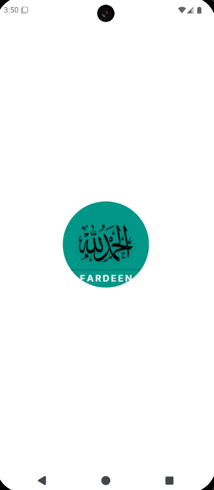
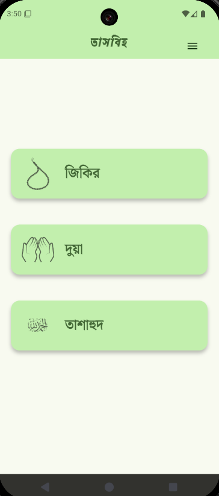
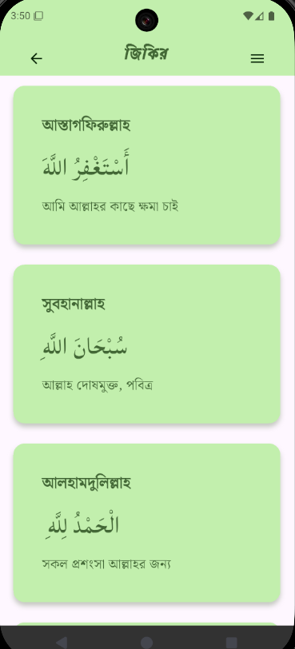
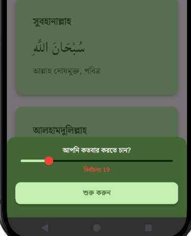
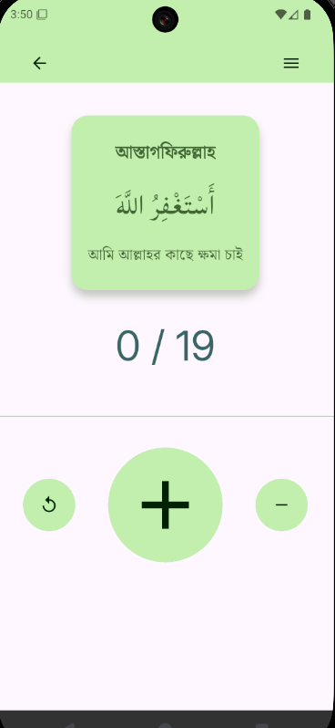
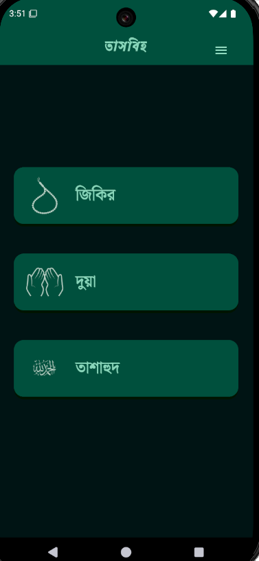
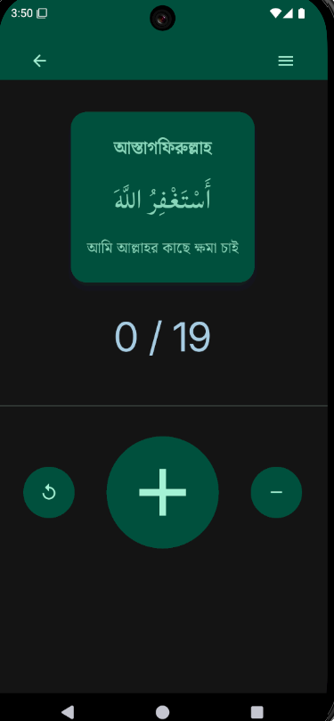
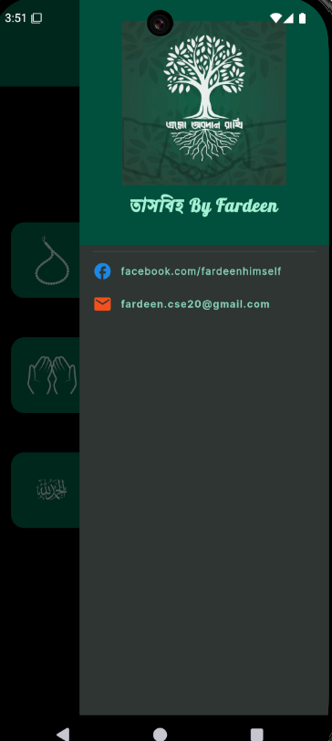

# Flutter Tasbeeh App

This is a tasbeeh app created with flutter without any state management tool. The app is inspired from a basic counter program.

## Features

- Light/dark mode toggle
- 3 modes (Reflect, Dua, and Dua of Salat)
- User can select how many times he wants to do dhikr.
- User can memorise dua from a selected number of dua's.
- Optimized for mobile (android) and desktop (windows).

## Screenshots
### Light Mode

### Dark Mode

## FAQ

#### How many times can I do Dhikr?

Ans: You can select the amount 

#### Does it remember how many times I did?

Ans: Since it doens't have any state management, it doesn't if you close and rerun the app.

## Support

To know more, email fardeen.cse20@gmail.com 
